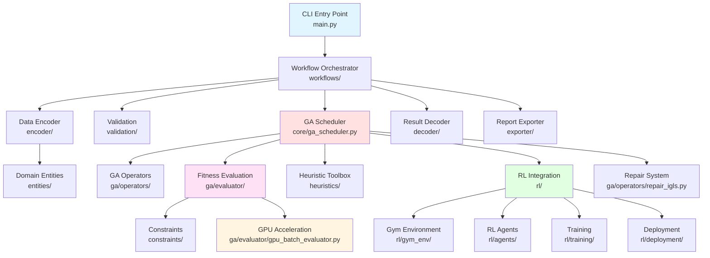
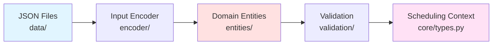
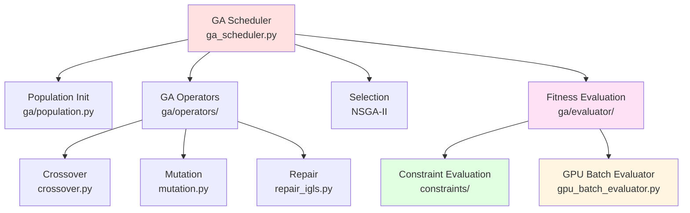
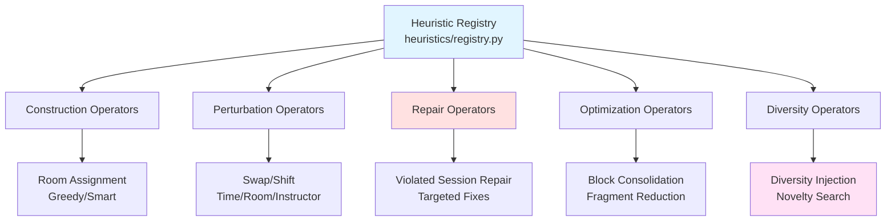
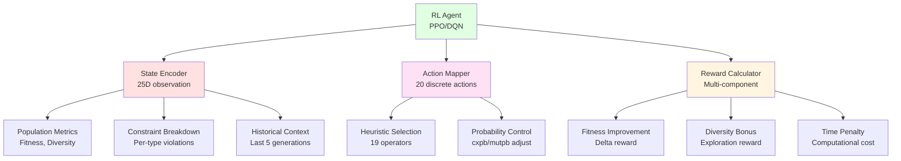
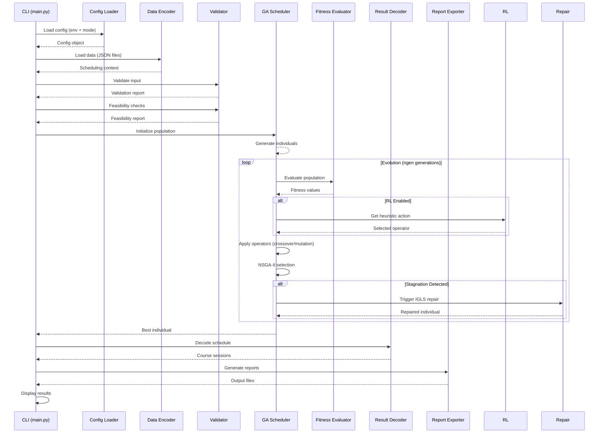
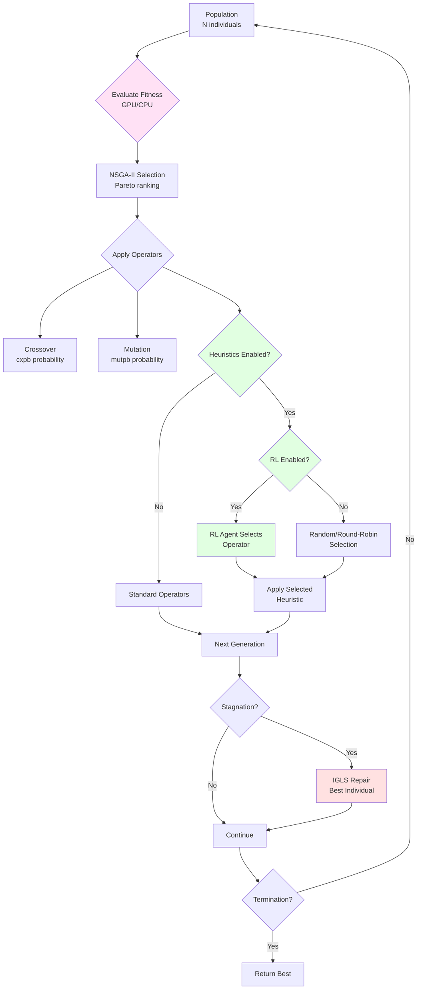

# High-Level Architecture

## System Overview

Schedule Engine is a modular constraint-based optimization system that combines genetic algorithms (NSGA-II), reinforcement learning, and local search to solve university course timetabling problems.



## Core Components

### 1. Entry Layer (`main.py`)
**Purpose:** CLI interface and workflow coordination

**Responsibilities:**
- Parse command-line arguments
- Initialize configuration
- Route to appropriate workflow
- Handle experiment management

**Key Files:**
- `main.py` - Entry point with environment/mode routing
- `src/workflows/standard_run.py` - Standard workflow orchestration

### 2. Data Layer
**Purpose:** Data loading, validation, and domain modeling



**Components:**
- **Encoder** (`src/encoder/`) - JSON → Python objects
- **Entities** (`src/entities/`) - Domain models (Course, Instructor, Room, Group)
- **Validation** (`src/validation/`) - Input integrity + feasibility checks
- **Time System** (`src/encoder/quantum_time_system.py`) - Time discretization

### 3. Optimization Core
**Purpose:** Genetic algorithm execution and population management



**Components:**
- **GA Scheduler** (`src/core/ga_scheduler.py`) - Main evolution loop
- **Population** (`src/ga/population.py`) - Individual generation
- **Operators** (`src/ga/operators/`) - Crossover, mutation, repair
- **Evaluator** (`src/ga/evaluator/`) - Fitness calculation (CPU/GPU)

### 4. Constraint System
**Purpose:** Evaluate hard/soft constraint violations

**Architecture:**
- **Hard Constraints** - Must be satisfied (0 violations required)
- **Soft Constraints** - Preferences (minimize violations)
- **Weighted Aggregation** - Configurable penalty weights

**Evaluation Modes:**
- **CPU Sequential** - Standard evaluation
- **CPU Parallel** - Multiprocessing (3-5x speedup)
- **GPU Batch** - CUDA acceleration (10-50x speedup)

**Key Files:**
- `src/constraints/hard_*.py` - Hard constraint functions
- `src/constraints/soft_*.py` - Soft constraint functions
- `src/ga/evaluator/gpu_batch_evaluator.py` - GPU implementation

### 5. Heuristic System
**Purpose:** 19 specialized repair/improvement operators



**Categories:**
1. **Construction** (2 ops) - Build schedules from scratch
2. **Perturbation** (9 ops) - Modify existing schedules
3. **Repair** (3 ops) - Fix specific violations
4. **Optimization** (3 ops) - Improve quality
5. **Diversity** (2 ops) - Maintain population variety

**Execution:**
- **Sequential** - One heuristic at a time
- **Parallel** - Multiple heuristics concurrently (3-5x speedup)
- **RL-Guided** - Adaptive selection via trained agent

### 6. RL Integration
**Purpose:** Learn optimal heuristic selection strategies



**Components:**
- **Gym Environment** (`src/rl/gym_env/`) - OpenAI Gym interface
- **Agents** (`src/rl/agents/`) - PPO/DQN implementations
- **Training** (`src/rl/training/`) - Curriculum learning + checkpoints
- **Deployment** (`src/rl/deployment/`) - Model loading + inference

### 7. Configuration System
**Purpose:** Hierarchical YAML-based configuration

```mermaid
graph TB
    A[base.yaml<br/>Common Settings] --> B[Environment Configs<br/>test/prod]
    B --> C[Runtime Mode Configs<br/>10 modes]
    C --> D[Config Loader<br/>Deep Merge]
    D --> E[Pydantic Validation<br/>Type Checking]
    E --> F[Global Config Object<br/>get_config()]
    
    style A fill:#e1f5ff
    style C fill:#ffe1e1
    style E fill:#ffe1f5
```

**Hierarchy:**
1. `configs/base.yaml` - Base settings (shared)
2. `configs/{env}.yaml` - Environment overrides (test/prod)
3. `configs/{category}/{mode}.yaml` - Runtime modes (10 modes)

**Loading:** Deep merge with Pydantic validation

### 8. Output Layer
**Purpose:** Result decoding and report generation

**Components:**
- **Decoder** (`src/decoder/`) - Individual → CourseSession mapping
- **Exporter** (`src/exporter/`) - JSON/PDF/Plot generation
- **Metrics** (`src/metrics/`) - Diversity, convergence, performance

## Data Flow

### End-to-End Pipeline



### GA Evolution Cycle



## Design Principles

### 1. Modularity
- **Clear separation of concerns** - Each module has single responsibility
- **Loose coupling** - Modules communicate via interfaces
- **High cohesion** - Related functionality grouped together

### 2. Extensibility
- **Plugin architecture** - New heuristics register in registry
- **Config-driven** - Behavior controlled via YAML
- **Killswitches** - Enable/disable features without code changes

### 3. Performance
- **GPU acceleration** - 10-50x speedup for constraint evaluation
- **Parallel execution** - Multiprocessing for operators
- **Lazy loading** - Models loaded on demand
- **Caching** - Reuse computed results

### 4. Reliability
- **Input validation** - Pydantic type checking
- **Feasibility checks** - Pre-flight constraint analysis
- **Error handling** - Graceful degradation (GPU → CPU fallback)
- **Testing** - >80% code coverage target

### 5. Reproducibility
- **Deterministic execution** - Seed control
- **Experiment tracking** - Manifest-based logging
- **Version control** - Config + code + data versioning
- **Documentation** - Comprehensive guides

## Technology Stack

### Core Libraries

**Genetic Algorithms:**
- **DEAP 1.4.1** - GA framework (toolbox, operators, selection)
- Custom NSGA-II implementation with multi-objective optimization

**Reinforcement Learning:**
- **Stable-Baselines3 2.3.2** - PPO/DQN agents
- **Gymnasium 0.29.1** - OpenAI Gym environment
- **PyTorch 2.4.1+cu121** - Neural network backend

**GPU Acceleration:**
- **PyTorch CUDA 12.1** - GPU batch evaluation
- **NumPy 1.26.4** - Scientific computing
- 10-50x speedup on NVIDIA GPUs

**Configuration & Validation:**
- **Pydantic 2.10.3** - Config validation + type checking
- **PyYAML 6.0.2** - YAML parsing
- Hierarchical config with deep merge

**Visualization & UI:**
- **Rich 13.9.4** - Terminal UI (progress bars, tables)
- **Matplotlib 3.9.4** - Plotting (evolution curves, Pareto fronts)
- **Seaborn 0.13.2** - Statistical plots

### Development Tools

- **Python 3.12** - Language (pinned exact version)
- **UV** - Package manager (modern, fast)
- **pytest** - Testing framework
- **black** - Code formatter (88 line length)
- **ruff** - Linter (fast, comprehensive)
- **mypy** - Type checker (static analysis)

## Performance Characteristics

### Execution Time

| Configuration | Time (without GPU) | Time (with GPU) | Speedup |
|---------------|-------------------|-----------------|---------|
| Test (30 gens) | 5-10 min | 1-2 min | 3-5x |
| Prod (2000 gens) | 24-48 hours | 1-2.5 hours | 13-34x |

### Speedup Breakdown

1. **GPU Batch Evaluation** - 10-50x (constraint evaluation)
2. **Parallel Operators** - 3-5x (crossover/mutation)
3. **Parallel Feasibility** - 3-5x (validation)
4. **Combined** - 13-34x (end-to-end)

### Scalability

- **Population size** - Linear scaling (O(n))
- **Constraint evaluation** - Linear with individuals (O(n))
- **Heuristic execution** - Parallel (independent operations)
- **GPU memory** - Batch size limited by VRAM (auto-tune)

## System Requirements

### Minimum

- **CPU:** 4 cores
- **RAM:** 8 GB
- **Disk:** 5 GB
- **GPU:** None (CPU fallback)

### Recommended

- **CPU:** 8+ cores (Intel i7/AMD Ryzen 7)
- **RAM:** 16 GB
- **Disk:** 10 GB SSD
- **GPU:** NVIDIA RTX 3060+ (8GB VRAM, CUDA 12.1)

### Optimal (Thesis Experiments)

- **CPU:** 16+ cores (Intel i9/AMD Ryzen 9)
- **RAM:** 32 GB
- **Disk:** 20 GB NVMe SSD
- **GPU:** NVIDIA RTX 3080+ (10GB VRAM, CUDA 12.1)

## Deployment Modes

### 1. Development
- Test environment (`--env test`)
- Quick iterations (30 gens)
- Debug logging enabled

### 2. Production
- Prod environment (`--env prod`)
- Full runs (2000 gens)
- Result logging only

### 3. Research
- Custom configs
- Long runs (5000+ gens)
- Extensive metrics collection

## See Also

- [Design Principles](02-design-principles.md) - Detailed design rationale
- [Components](03-components/) - Module-level documentation
- [Data Flow](04-data-flow.md) - Detailed sequence diagrams
- [Code Organization](../code/01-code-structure.md) - File layout guide
