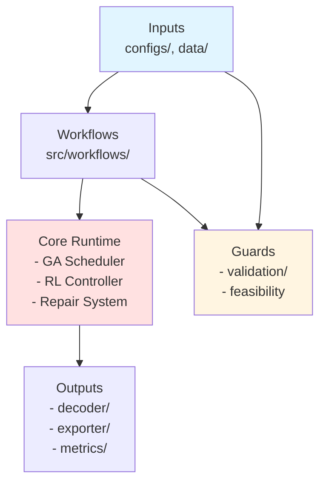

# Design Principles

This document captures the architectural values that keep Schedule Engine maintainable, extensible, and fast. Each principle ties directly back to concrete modules and configuration switches in the repository.

## Architectural Goals

1. **Deterministic optimization** – reproducible GA/RL runs given a seed.
2. **Progressive experimentation** – safely enable new research features via runtime modes.
3. **Interactive diagnostics** – surface enough telemetry to debug constraint spikes or operator drift in minutes.
4. **Hardware awareness** – degrade gracefully when CUDA is unavailable while exploiting all parallelism when it is.

## Core Principles

### 1. Modular Boundaries

| Layer | Responsibilities | Modules | Notes |
| --- | --- | --- | --- |
| **Entry & Workflow** | Parse CLI, choose runtime mode, orchestrate phases | `main.py`, `src/workflows/standard_run.py`, `src/workflows/experiment_manager.py` | Workflows never mutate config; they receive validated `Config` objects. |
| **Data & Validation** | Convert JSON files into typed entities, ensure feasibility | `src/encoder/`, `src/entities/`, `src/validation/` | Validation must succeed before GA is allowed to allocate populations. |
| **Optimization Core** | Maintain populations, apply GA operators, call RL/repair hooks | `src/core/ga_scheduler.py`, `src/ga/`, `src/heuristics/` | Core does not perform I/O; it emits domain-neutral individuals. |
| **Presentation Layer** | Decode chromosomes and export deliverables | `src/decoder/`, `src/exporter/`, `src/metrics/` | Reads only immutable individuals/context. |

### 2. Configuration-First Behavior

- **Hierarchical merge** – `configs/base.yaml` → env override → runtime mode ensures every option has a single authoritative source.
- **Killswitches** – each advanced feature has an `enabled` flag (`rl.enabled`, `repair.igls.enabled`, `evaluator.gpu.enabled`) so regressions can be isolated without code edits.
- **Schema validation** – `src/config/models/*.py` use Pydantic to prevent invalid values from reaching the GA.
- **Runtime visibility** – `get_config()` memoizes the validated object so access is cheap even inside tight loops.

### 3. Progressive Disclosure of Complexity

- Beginners can run `uv run test` with defaults: GA only, minimal heuristics.
- Researchers enable RL/local-search modes via CLI flags (`--mode rl`, `--mode specialists`).
- Changelog and experiment manifest capture which switches were active for published results.

### 4. Deterministic & Auditable Runs

- **Seed plumbing** – CLI accepts `--seed` → stored in config → passed into DEAP toolbox and PyTorch RNGs.
- **Manifest logging** – `output/experiment_manifest.json` captures config hash, git commit, and wall-clock start/stop times.
- **Stateless operators** – heuristics avoid module-level caches so repeated runs with same seed remain identical.

### 5. Performance as Opt-In Layers

1. **Baseline**: CPU-only evaluation + core GA.
2. **Parallel operators**: enable via `ga.parallel.enabled`.
3. **GPU batch evaluator**: toggled with `evaluator.gpu.enabled`, falls back automatically when CUDA is unavailable.
4. **RL guidance**: adds controller overhead only when `rl.enabled` is true.

Each layer can be independently disabled, which keeps profiling straightforward.

### 6. RL Safety Rails

- **Observation contract** – 25D state vector defined in `src/rl/gym_env/state_encoder.py`; GA asserts length consistency before calling the agent.
- **Action mapper registry** – `src/rl/gym_env/action_mapper.py` binds discrete IDs to heuristics so PPO can never invoke unregistered code.
- **Reward shaping config** – weights for fitness gain/diversity bonus/time penalty live under `rl.reward`. Adjustments never require touching agent logic.
- **Fallback policy** – if RL inference raises, controller logs the issue, increments a metric, and defaults to round-robin selection.

### 7. Robustness & Observability

- **Validation gates** – `src/validation/input_validator.py` and `feasibility_checker.py` stop the run early with human-readable Rich tables.
- **Console service** – `src/utils/console_service.py` standardizes colorful logs with timestamps.
- **Metrics hooks** – `src/metrics/recorder.py` captures generation-level statistics for later plotting.
- **Structured exceptions** – custom errors in `src/exceptions.py` differentiate between data, config, and runtime failures.

### 8. Extensibility Patterns

- **Registries over conditionals** – heuristics, RL agents, exporters, and workflows rely on registration decorators instead of `if/elif` ladders.
- **Protocol-oriented design** – abstract base classes (`src/exporter/base_exporter.py`, `src/rl/agents/base_agent.py`) define tiny interfaces, simplifying user-defined extensions.
- **Documentation hooks** – every new feature must register itself in `docs/00-INDEX.md` and include cross-links so the knowledge graph stays connected.

## Applying the Principles

| Scenario | Principle Applied | Implementation Detail |
| --- | --- | --- |
| Add a heuristic operator | Modular boundaries & registries | Implement in `src/heuristics/operators/`, call `register_heuristic()`, expose killswitch probability in config. |
| Introduce new RL reward term | Configuration-first & RL safety | Add field to `rl.reward` schema, update reward calculator; no agent code changes. |
| Profile GPU bottleneck | Performance layering | Disable RL/heuristics via config to isolate evaluator, toggling `evaluator.gpu.enabled` on/off for A/B tests. |
| Ship thesis experiment | Deterministic runs | Freeze git commit, export manifest, archive config under `configs/experiments/`. |

Keeping these principles explicit helps reviewers and future contributors quickly verify whether a proposal fits the architecture before any code is written.
