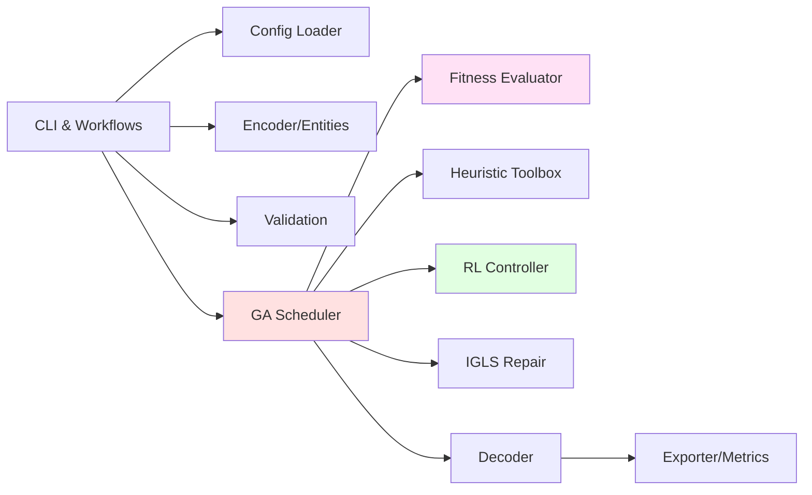

# Component Breakdown

This document drills into each major subsystem, outlining its responsibilities, dependencies, and extension hooks.

## 1. CLI & Workflow Layer

| Aspect | Details |
| --- | --- |
| **Key Files** | `main.py`, `src/workflows/standard_run.py`, `src/workflows/experiment_manager.py`, `scripts/cli.py` |
| **Inputs** | CLI flags (`--env`, `--mode`, `--config`, `--seed`, experiment subcommands) |
| **Outputs** | Workflow results, exit codes, manifest entries |
| **Responsibilities** | Resolve runtime mode, orchestrate load → validate → GA → decode → export, record experiment metadata |
| **Extension Points** | Add new workflow under `src/workflows/` and register in CLI; update `pyproject.toml` scripts section |

## 2. Configuration System

| Aspect | Details |
| --- | --- |
| **Key Files** | `configs/*.yaml`, `src/config/loader.py`, `src/config/models/*.py`, `src/config/runtime_mode.py` |
| **Inputs** | YAML files (base + env override + runtime mode), optional explicit path |
| **Outputs** | Pydantic `Config` object cached by `get_config()` |
| **Responsibilities** | Deep-merge hierarchical configs, validate schema, expose killswitches and probabilities, hash configs for manifests |
| **Extension Points** | Create new runtime mode YAML, extend `RuntimeMode` enum, add new Pydantic field with default and validators |

## 3. Encoder & Entities

| Aspect | Details |
| --- | --- |
| **Key Files** | `src/encoder/*`, `src/entities/*`, `data/*.json`, `src/encoder/quantum_time_system.py` |
| **Inputs** | Course, group, instructor, room JSON files |
| **Outputs** | `SchedulingContext` (courses, instructors, groups, rooms, time system) |
| **Responsibilities** | Parse JSON, validate schema, link foreign keys, discretize time slots |
| **Extension Points** | Add new entity fields (update dataclasses + JSON schema), support alternate time systems, add preprocessing hooks |

## 4. Validation & Feasibility

| Aspect | Details |
| --- | --- |
| **Key Files** | `src/validation/input_validator.py`, `src/validation/feasibility_checker.py`, `src/validation/reporters/*.py` |
| **Inputs** | `SchedulingContext`, config thresholds |
| **Outputs** | Rich tables/logs, feasibility report (success/fail), optional CSV/JSON diagnostics |
| **Responsibilities** | Ensure data completeness, detect doubles-booked instructors, verify room capacities prior to GA |
| **Extension Points** | Add checks by extending `BaseValidationRule`, register via `ValidationRegistry` |

## 5. GA Scheduler & Population Management

| Aspect | Details |
| --- | --- |
| **Key Files** | `src/core/ga_scheduler.py`, `src/ga/population.py`, `src/ga/individual_factory.py` |
| **Inputs** | `SchedulingContext`, config GA settings, heuristic registry, RL controller handle |
| **Outputs** | Evolved population, best individual, telemetry per generation |
| **Responsibilities** | Initialize toolbox, maintain loop, coordinate selection/crossover/mutation/heuristics/RL, trigger repair, collect stats |
| **Extension Points** | Plug new selection strategies, add callbacks (e.g., `on_generation_end`), expose new metrics to RL state encoder |

## 6. Fitness Evaluator & Constraints

| Aspect | Details |
| --- | --- |
| **Key Files** | `src/ga/evaluator/cpu_evaluator.py`, `src/ga/evaluator/gpu_batch_evaluator.py`, `src/constraints/*`, `src/constraints/registry.py` |
| **Inputs** | Population (list of individuals), constraint registry, GPU availability flag |
| **Outputs** | Fitness tuples (hard violations, soft penalty), per-constraint breakdown |
| **Responsibilities** | Batch evaluation, GPU tensor conversion, weight aggregation, partial derivative metrics for RL reward |
| **Extension Points** | Add constraint modules (inherit `BaseConstraint`), register to registry, expose new weight knobs in config |

## 7. Heuristic Toolbox

| Aspect | Details |
| --- | --- |
| **Key Files** | `src/heuristics/registry.py`, `src/heuristics/operators/*.py`, `src/heuristics/policies/*.py` |
| **Inputs** | Current population, GA probabilities (`ga.heuristics.*`), RL-selected operator IDs |
| **Outputs** | Modified individuals, diversity metrics |
| **Responsibilities** | Provide 19 low-level operators grouped into construction, perturbation, repair, optimization, diversity |
| **Extension Points** | Implement new operator file, decorate with `@register_heuristic`, document expected invariants, add to RL action map |

## 8. RL Controller

| Aspect | Details |
| --- | --- |
| **Key Files** | `src/rl/gym_env/schedule_env.py`, `src/rl/gym_env/state_encoder.py`, `src/rl/gym_env/action_mapper.py`, `src/rl/agents/*`, `src/rl/training/*.py` |
| **Inputs** | Population statistics, constraint breakdown, historical metrics |
| **Outputs** | Discrete action (heuristic ID or probability adjustment), optional probability scaling |
| **Responsibilities** | Encode state, run inference, optionally train via curriculum, persist checkpoints, enforce fallbacks |
| **Extension Points** | Add new agent class, extend action space, add reward terms, integrate new observation features |

## 9. Repair & Local Search

| Aspect | Details |
| --- | --- |
| **Key Files** | `src/ga/operators/repair_igls.py`, `src/lns/*` (if CP/LNS enabled), `src/ga/repair_manager.py` |
| **Inputs** | Best individual, stagnation detector signal, config thresholds |
| **Outputs** | Repaired individual or original if repair fails |
| **Responsibilities** | Detect stagnation, carve out violated subproblems, run Iterative Greedy Local Search, reintegrate results |
| **Extension Points** | Implement additional repair strategies, register under `repair.strategies`, expose knobs in config |

## 10. Decoder, Exporter & Metrics

| Aspect | Details |
| --- | --- |
| **Key Files** | `src/decoder/course_session_decoder.py`, `src/exporter/*`, `src/metrics/*` |
| **Inputs** | Best individual, scheduling context, telemetry history |
| **Outputs** | JSON schedule, PDF calendar, plots (fitness, diversity, Pareto front), textual reports |
| **Responsibilities** | Translate genes → sessions, render human-friendly outputs, store experiment artifacts |
| **Extension Points** | Add exporters by implementing `BaseExporter`, register new metric trackers, support additional visualization formats |

## 11. Logging & Diagnostics

| Aspect | Details |
| --- | --- |
| **Key Files** | `src/utils/console_service.py`, `src/utils/logger.py`, `logs/`, `output/experiment_manifest.json` |
| **Inputs** | Structured events from workflows/GA/RL |
| **Outputs** | Rich console output, log files, manifests, tensorboard traces |
| **Responsibilities** | Provide consistent logging format, colorized console sections, experiment history |
| **Extension Points** | Add new log channels, integrate with external monitoring (e.g., WANDB) behind config toggles |

## Dependency Matrix

| Component | Depends On | Consumed By |
| --- | --- | --- |
| Workflows | Config, Encoder, Validation | Users, Experiment scripts |
| Encoder | Data JSON, Config | Validation, GA Scheduler |
| Validation | Encoder output | Workflows (gate) |
| GA Scheduler | Config, SchedulingContext, Heuristics, RL | Decoder, Metrics |
| Fitness Evaluator | Constraints, GPU service | GA Scheduler, RL reward |
| Heuristics | GA Scheduler, RL | GA population |
| RL Controller | GA telemetry, Config | GA operator selection |
| Repair System | GA best individual | GA population |
| Decoder/Exporter | GA results, Context | Users, reports |

Understanding these relationships helps contributors reason about change impact—for example, modifying constraint output touches evaluators, RL rewards, and exporters, so the dependency matrix acts as a quick blast-radius guide.
