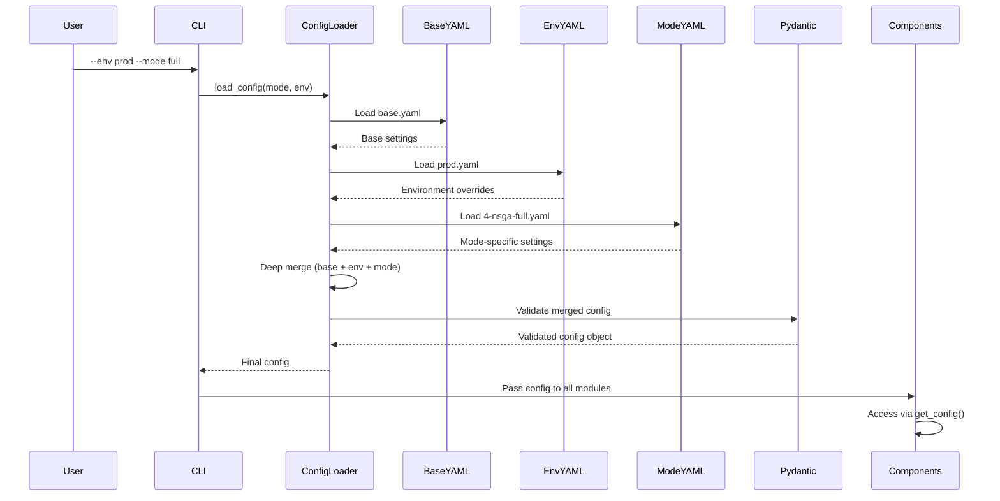
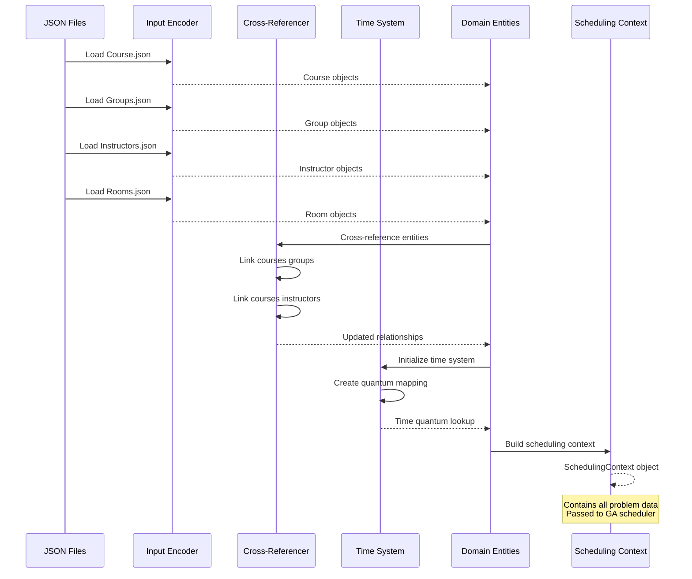
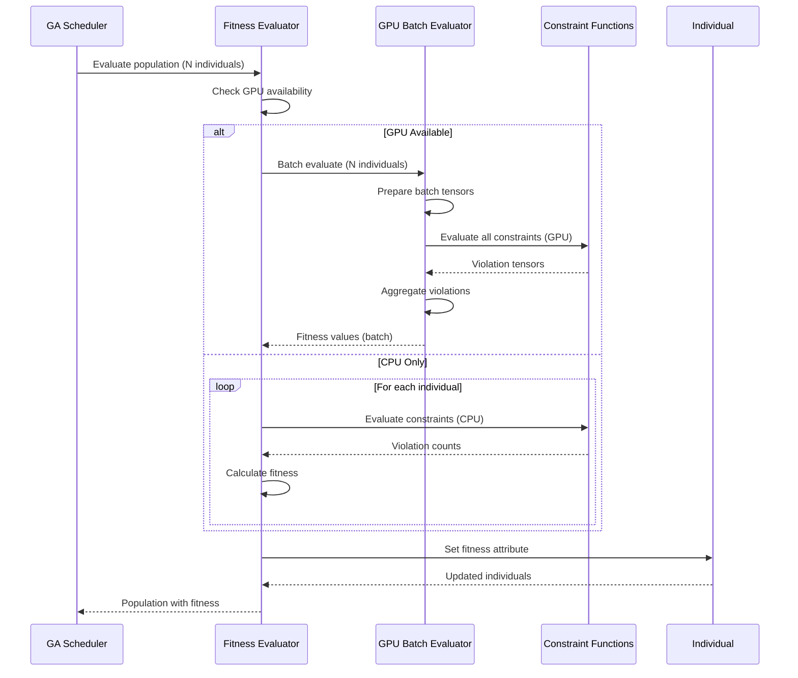
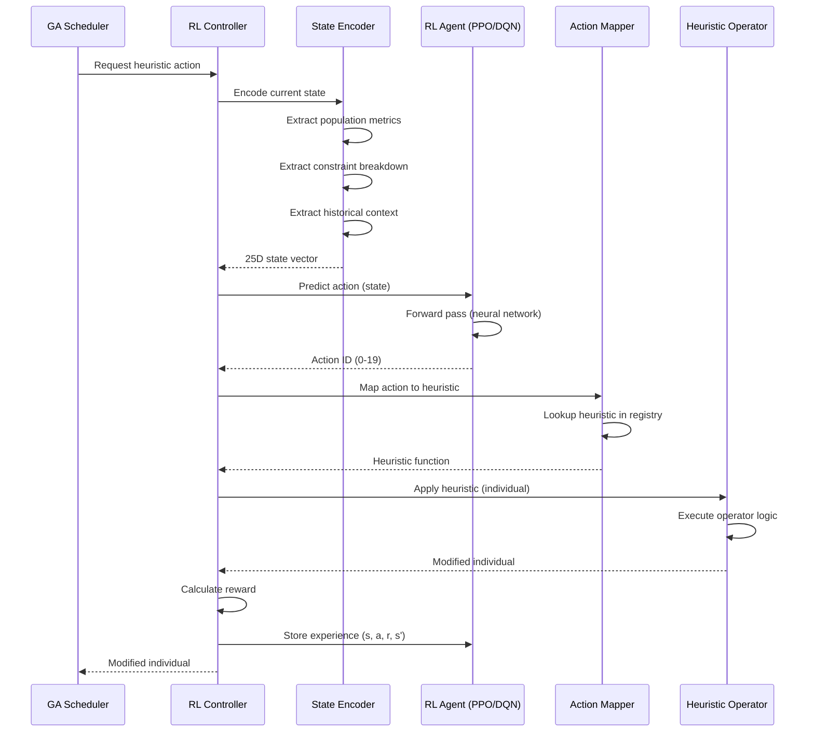
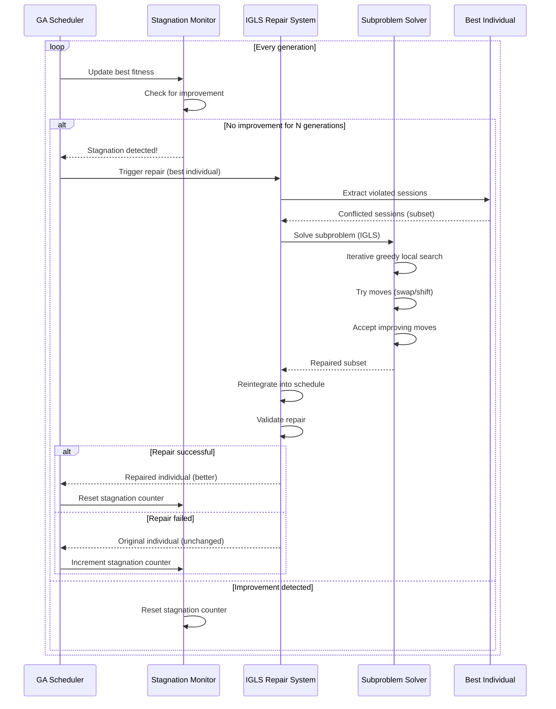
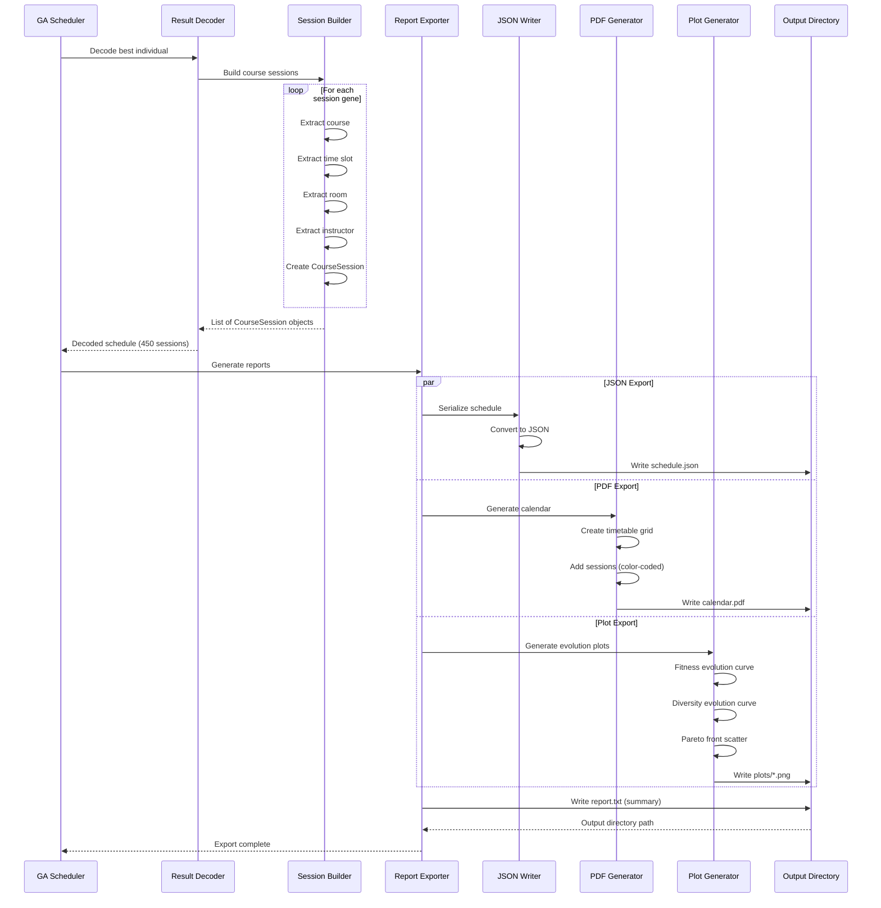

# Data Flow Architecture

## Complete System Data Flow

```mermaid
flowchart TD
    Start([User Input]) --> CLI[CLI Parser<br/>main.py]
    CLI --> LoadConfig[Load Configuration<br/>configs/*.yaml]
    LoadConfig --> LoadData[Load JSON Data<br/>data/]
    
    LoadData --> Course[Course.json<br/>150 courses]
    LoadData --> Groups[Groups.json<br/>30 groups]
    LoadData --> Instructors[Instructors.json<br/>50 instructors]
    LoadData --> Rooms[Rooms.json<br/>40 rooms]
    
    Course --> Encoder[Input Encoder<br/>encoder/]
    Groups --> Encoder
    Instructors --> Encoder
    Rooms --> Encoder
    
    Encoder --> Entities[Domain Entities<br/>Course, Group, Instructor, Room]
    Entities --> TimeSystem[Quantum Time System<br/>Discretization]
    TimeSystem --> Context[Scheduling Context<br/>Complete problem data]
    
    Context --> Validation[Input Validation<br/>validation/input_validator.py]
    Validation --> Feasibility[Feasibility Checks<br/>validation/feasibility_checker.py]
    
    Feasibility -->|Pass| InitPop[Initialize Population<br/>ga/population.py]
    Feasibility -->|Fail| Report1[Feasibility Report<br/>Warning/Error]
    
    InitPop --> Pop[Population<br/>N individuals]
    
    Pop --> EvalLoop{Evolution Loop<br/>ngen generations}
    
    EvalLoop --> Evaluate[Fitness Evaluation<br/>ga/evaluator/]
    Evaluate -->|GPU Available| GPU[GPU Batch Evaluator<br/>10-50x speedup]
    Evaluate -->|CPU Only| CPU[CPU Sequential Evaluator]
    
    GPU --> Constraints[Constraint Evaluation<br/>constraints/]
    CPU --> Constraints
    
    Constraints --> Hard[Hard Constraints<br/>14 types]
    Constraints --> Soft[Soft Constraints<br/>4 types]
    
    Hard --> Fitness[Fitness Values<br/>-hard, -soft]
    Soft --> Fitness
    
    Fitness --> Selection[NSGA-II Selection<br/>Pareto ranking]
    Selection --> Elite[Elite Preservation<br/>10% best]
    Selection --> Breeding[Breeding Pool<br/>90%]
    
    Breeding --> Operators{Apply Operators}
    
    Operators --> Crossover[Crossover<br/>cxpb=0.75]
    Operators --> Mutation[Mutation<br/>mutpb=0.25]
    Operators -->|Heuristics Enabled| HeurChoice{Heuristic Selection}
    
    HeurChoice -->|RL Enabled| RLAgent[RL Agent<br/>PPO/DQN]
    HeurChoice -->|RL Disabled| Random[Random/Round-Robin]
    
    RLAgent --> StateEnc[State Encoder<br/>25D observation]
    StateEnc --> RLModel[RL Model<br/>Neural network]
    RLModel --> Action[Action Mapper<br/>20 actions]
    Action --> SelectHeur[Selected Heuristic<br/>1 of 19 operators]
    
    Random --> SelectHeur
    SelectHeur --> ApplyHeur[Apply Heuristic<br/>heuristics/]
    
    Crossover --> Offspring[Offspring<br/>New generation]
    Mutation --> Offspring
    ApplyHeur --> Offspring
    
    Offspring --> Stagnation{Stagnation<br/>Detected?}
    Stagnation -->|Yes| Repair[IGLS Repair<br/>repair_igls.py]
    Stagnation -->|No| NextGen[Next Generation]
    Repair --> NextGen
    
    NextGen --> Elite
    Elite --> NewPop[Updated Population]
    NewPop --> Termination{Termination<br/>Criteria?}
    
    Termination -->|No| EvalLoop
    Termination -->|Yes| BestInd[Best Individual<br/>Chromosome]
    
    BestInd --> Decoder[Result Decoder<br/>decoder/]
    Decoder --> Sessions[Course Sessions<br/>450 sessions]
    
    Sessions --> Exporter[Report Exporter<br/>exporter/]
    Exporter --> JSON[schedule.json<br/>Detailed data]
    Exporter --> PDF[calendar.pdf<br/>Visual timetable]
    Exporter --> Plots[plots/<br/>Evolution curves]
    Exporter --> Report2[report.txt<br/>Summary]
    
    JSON --> Output([Output Directory<br/>output/])
    PDF --> Output
    Plots --> Output
    Report2 --> Output
    Report1 --> Output
    
    style CLI fill:#e1f5ff
    style Evaluate fill:#ffe1f5
    style GPU fill:#fff5e1
    style RLAgent fill:#e1ffe1
    style Decoder fill:#ffe1e1
```



## Message Passing Patterns

### 1. Configuration Propagation



### 2. Data Encoding Pipeline



### 3. Fitness Evaluation Flow



### 4. RL Agent Interaction



### 5. Repair System Trigger



### 6. Result Export Pipeline



## Component Communication

### Global State Management

**Config Access Pattern:**
```python
# Singleton pattern via module-level cache
from src.config import get_config

config = get_config()  # Returns cached config
print(config.ga.ngen)  # Access nested settings
```

**Scheduling Context:**
```python
# Passed explicitly through function calls
context = SchedulingContext(
    courses=courses,
    groups=groups,
    instructors=instructors,
    rooms=rooms,
    time_system=time_system
)

# Passed to GA scheduler
scheduler = GAScheduler(context, config)
```

### Event-Driven Communication

**Callback System (RL Training):**
```python
# Custom callbacks for training events
callbacks = [
    PeriodicEvaluationCallback(eval_freq=5000),
    EarlyStoppingCallback(patience=5),
    CheckpointCallback(save_freq=10000)
]

trainer.train(callbacks=callbacks)
```

**Progress Tracking (Rich):**
```python
# Live progress updates
with Progress() as progress:
    task = progress.add_task("Evolution", total=ngen)
    for gen in range(ngen):
        # ... evolution logic ...
        progress.update(task, advance=1)
```

### Parallel Communication

**Multiprocessing (CPU):**
```python
# Worker pool for parallel evaluation
with ThreadPoolExecutor(max_workers=num_cores) as executor:
    futures = [executor.submit(evaluate, ind) for ind in population]
    results = [f.result() for f in futures]
```

**GPU Batch Communication:**
```python
# Single GPU call for batch
fitness_batch = gpu_evaluator.evaluate_batch(
    population,
    batch_size=100
)
```

## Data Structures

### Core Data Types

**Individual (Chromosome):**
```python
# DEAP Individual (list of SessionGene)
Individual = list[SessionGene]

# SessionGene structure
@dataclass
class SessionGene:
    course_id: str
    session_index: int  # Which session of the course
    time_quantum_start: int  # Discretized time
    duration_quanta: int  # Duration in quanta
    room_id: str
    instructor_id: str
    group_ids: list[str]
```

**Fitness:**
```python
# Two-objective minimization
fitness = (
    -hard_violations,  # First objective (minimize)
    -soft_penalty      # Second objective (minimize)
)

# Pareto dominance: fitness1 dominates fitness2 if:
# - fitness1 is no worse in all objectives
# - fitness1 is better in at least one objective
```

**Scheduling Context:**
```python
@dataclass
class SchedulingContext:
    courses: list[Course]
    groups: list[Group]
    instructors: list[Instructor]
    rooms: list[Room]
    time_system: QuantumTimeSystem
    config: Config
```

### Message Formats

**RL State (25D vector):**
```python
state = [
    gen / max_gen,                    # Progress
    best_hard / total_hard,           # Hard violation ratio
    best_soft / max_soft,             # Soft penalty ratio
    avg_hard / total_hard,            # Population avg hard
    avg_soft / max_soft,              # Population avg soft
    diversity,                        # Genotypic diversity
    stagnation / max_stagnation,      # Stagnation ratio
    # ... 18 more features
]
```

**RL Action (discrete):**
```python
action_id = 0..19  # Maps to heuristic operator

# Action mapping
ACTION_MAP = {
    0: "greedy_construction",
    1: "smart_construction",
    2: "swap_rooms_all",
    # ... 17 more operators
}
```

**Constraint Violation Report:**
```python
{
    "hard_constraints": {
        "student_group_exclusivity": 15,  # 15 violations
        "instructor_exclusivity": 20,
        "room_exclusivity": 15,
        # ... other constraints
    },
    "soft_constraints": {
        "avoid_early_sessions": 12,
        "avoid_late_sessions": 8,
        # ... other constraints
    },
    "total_hard": 50,
    "total_soft": 28.7
}
```

## See Also

- [High-Level Architecture](01-high-level-architecture.md) - System overview
- [Components](03-components/) - Module details
- [Code Structure](../code/01-code-structure.md) - File organization
