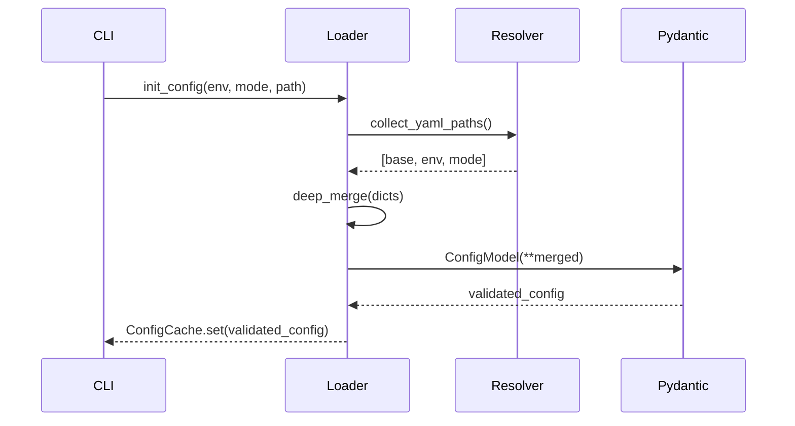
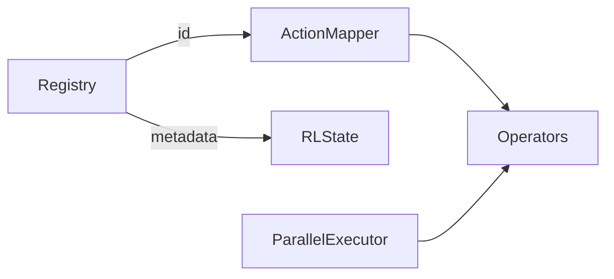

# Module Deep Dives

This guide explains how the most complex modules are wired internally so you can extend them confidently.

## 1. `src/core/ga_scheduler.py`

```mermaid
flowchart TD
    A[standard_run.run()] --> B[GAScheduler(...)]
    B --> C[_init_toolbox]
    B --> D[_initialize_population]
    D --> E[population.init_population]
    B --> F[evolve]
    F --> G[_evaluate_population]
    F --> H[_apply_operators]
    H --> I[_select_with_nsga2]
    H --> J[_apply_heuristics]
    F --> K[_handle_stagnation]
    F --> L[_record_metrics]
```

| Aspect | Details |
| --- | --- |
| **Hot paths** | `_evaluate_population()` (fitness), `_apply_heuristics()` (operator orchestration) |
| **State** | Maintains toolbox, hall-of-fame, stagnation counter, telemetry buffers |
| **Threading** | Uses multiprocessing or GPU evaluator based on config |
| **Extension pattern** | Introduce new callbacks by extending `_fire_event("event_name")` list in scheduler |
| **Tests** | `test/unit/test_ga_scheduler.py`, `test/rl/test_rl_integration.py` |

**Extension example:** Add a `post_generation` hook.
1. Define callback signature in `src/core/types.py`.
2. Append call site in `_end_generation()`.
3. Register callback via config (`ga.callbacks.post_generation`).

## 2. Configuration Loader (`src/config/loader.py`)



| Highlights | Notes |
| --- | --- |
| Deep merge order | `base.yaml` ← env ← mode ← CLI override |
| Validation | Pydantic enforces types, custom validators ensure cross-field constraints (e.g., population divisible by batch size) |
| Runtime modes | `RuntimeMode.validate_config()` ensures killswitch combinations make sense |
| Hashing | `ConfigHash.from_config()` enables manifest diffing |
| Testing | `test/unit/config/test_loader.py`, `uv run verify-config` |

## 3. Constraint Framework (`src/constraints/`)

| Piece | Purpose |
| --- | --- |
| `base_constraint.py` | Defines `evaluate()` contract returning violation counts |
| `registry.py` | Discovers constraints via decorators, provides iteration order |
| `hard_*.py` | Pure functions that inspect `SessionGene` lists and emit integers |
| `soft_*.py` | Weighted penalties returning floats |
| `fixtures/*.json` | Synthetic data for constraint unit tests |

**Extension checklist:**
1. Create new module (e.g., `hard_minimum_rest.py`).
2. Implement `evaluate(individual, context, cache)`.
3. Register via `@register_constraint(type="hard", name="minimum_rest")`.
4. Add config weight under `constraints.weights`.
5. Write tests hitting corner cases and GPU evaluator compatibility.

## 4. Heuristic Toolbox (`src/heuristics/`)



| Component | Description |
| --- | --- |
| `registry.py` | Central source of truth; each operator registers ID, category, default probability, config key |
| `operators/*.py` | Actual heuristics grouped per category |
| `policies/*.py` | Probability schedulers (round-robin, adaptive, RL-controlled) |
| `parallel_executor.py` | ThreadPool for heuristics flagged as parallel-safe |

**Adding an operator:**
- Implement pure function `def operator(individual, context, config, rng) -> bool` returning success.
- Decorate with `@register_heuristic("swap_instructors", category="perturbation", complexity="O(n)")`.
- Document any prerequisite (e.g., requires instructor availability cache) in docstring.
- Update RL action map if you want the agent to call it.

## 5. RL Environment (`src/rl/gym_env/`)

| File | Role |
| --- | --- |
| `schedule_env.py` | Gymnasium `Env` subclass controlling episode length (= generations) |
| `state_encoder.py` | Builds 25D normalized vector (progress, fitness stats, constraint histogram, operator usage) |
| `action_mapper.py` | Maps discrete action ID → heuristic callable or probability adjustment |
| `reward_calculator.py` | Weighted mix of fitness delta, diversity delta, wall-clock penalty |

**Training loop:** `scripts/training/train_rl_agent.py`
1. Spins multiple env instances via VecEnv.
2. Runs curriculum (easy → medium → hard context sizes).
3. Saves checkpoints every `checkpoint.save_freq` generations.
4. Logs to TensorBoard in `logs/tensorboard/training/`.

## 6. GPU Batch Evaluator (`src/ga/evaluator/gpu_batch_evaluator.py`)

| Stage | Implementation |
| --- | --- |
| Tensor prep | `_prepare_batch_tensors()` builds `torch.int32` tensors for rooms, instructors, groups |
| Constraint kernels | Vectorized PyTorch operations mimic CPU logic but operate on entire batch |
| Aggregation | `_aggregate_violations()` sums booleans per constraint, converts back to Python ints |
| Fallbacks | Any CUDA error triggers warning + CPU retry |
| Config knobs | `evaluator.gpu.batch_size`, `evaluator.gpu.min_population_to_use_gpu` |

**Debugging tip:** set `TORCH_SHOW_CPP_STACKTRACES=1` to debug kernel errors.

## 7. Repair System (`src/ga/operators/repair_igls.py`)

| Phase | Description |
| --- | --- |
| **Candidate selection** | Identify top-k violated sessions (configurable) |
| **Destroy step** | Remove conflicting assignments |
| **Local search** | Try swaps/shifts using heuristics reused from toolbox |
| **Evaluation** | Accept move if it reduces weighted violation score |
| **Timeout** | CONFIG: `repair.igls.max_seconds` ensures repair never stalls GA |

**Extending repairs:**
- Introduce new neighborhood moves under `src/ga/operators/repair_moves.py`.
- Register move list in config to pick combos per mode.
- Add targeted tests in `test/unit/test_repair_igls.py` using synthetic contexts.

## 8. Workflow Utilities (`src/workflows/)`

| Module | Highlights |
| --- | --- |
| `standard_run.py` | Defines `StandardRun` class with `execute()` orchestrating sequential phases. Uses dependency injection so tests can swap encoder/GA mocks. |
| `experiment_manager.py` | Handles output directory creation, manifest append, and duplication checks. |
| `comparison.py` (if enabled) | Loads past manifests to chart improvements. |

**Experiment manifest schema:**
```json
{
  "id": "2025-11-20T05:42:33Z",
  "git_commit": "abc1234",
  "config_hash": "dea5...",
  "mode": "rl",
  "env": "prod",
  "seed": 42,
  "wall_time_sec": 8421,
  "best_fitness": [-12, -4.8]
}
```

Understanding these modules, their contracts, and their tests makes large changes (like adding new runtime modes or RL reward terms) far less risky.
