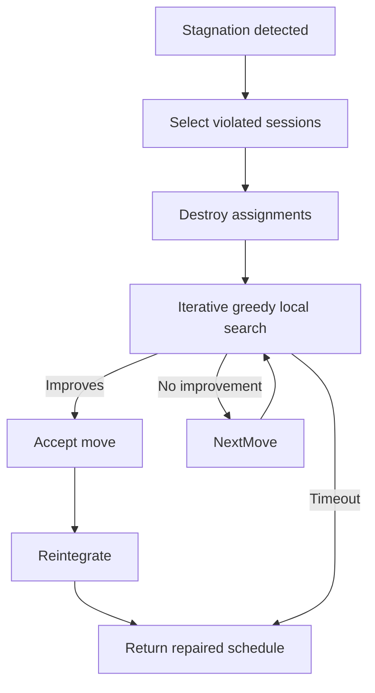

# IGLS Repair System Reference

Iterative Greedy Local Search (IGLS) repairs stagnating schedules by destroying and rebuilding problematic regions.

## Algorithm Steps

1. **Detect stagnation** (`ga_scheduler._handle_stagnation`)
   - Triggered after `repair.stagnation.generations` without improvement.
2. **Select candidates** (`repair_igls._select_sessions_for_repair`)
   - Choose top-N violated sessions weighted by constraint severity.
3. **Destroy phase** (`_destroy_region`)
   - Remove selected sessions, freeing rooms/timeslots.
4. **Local search** (`_iterative_greedy_search`)
   - Evaluate neighborhood moves (swap, shift, reassign room/instructor).
5. **Acceptance**
   - Accept moves lowering weighted violation score; tie-break on soft penalty.
6. **Timeout guard**
   - Abort if `repair.igls.max_seconds` reached.
7. **Reintegration** (`_reintegrate_sessions`)
   - Reinsert repaired sessions and update caches.



## Key Files

| File | Role |
| --- | --- |
| `src/ga/operators/repair_igls.py` | Main repair logic |
| `src/ga/operators/repair_moves.py` | Defines swap/shift moves |
| `src/ga/operators/repair_selection.py` | Chooses sessions/rooms/instructors to target |
| `src/ga/operators/repair_metrics.py` | Scores moves, tracks improvement |

## Configuration Knobs (`configs/base.yaml`)

```yaml
repair:
  igls:
    enabled: true
    trigger_generations: 15
    max_sessions: 40
    max_seconds: 25
    search:
      neighborhood: ["swap_room", "shift_time", "swap_instructor"]
      max_attempts_per_session: 10
      accept_ties: false
```

- **`max_sessions`** – upper bound on destroyed sessions; keeps repair localized.
- **`neighborhood`** – list of moves; add new ones by name when extending `repair_moves.py`.
- **`accept_ties`** – allow zero-improvement moves to escape plateaus.

## Metrics & Logging

- `RepairStats` dataclass measures:
  - `sessions_repaired`
  - `hard_delta`
  - `soft_delta`
  - `wall_time_ms`
  - `success` boolean
- Logged via Rich table at end of repair invocation.
- Telemetry appended to `output/repair_history.csv` when enabled.

## Extending IGLS

1. **New move type**
   - Implement `def move_fn(individual, context, rng) -> MoveResult`.
   - Register in `REPAIR_MOVES` dict.
   - Reference by name in config.
2. **Custom selection strategy**
   - Subclass `BaseRepairSelector` to prioritize e.g., rooms or instructors.
3. **Adaptive timeout**
   - Hook into `repair.igls.dynamic_timeout` to scale max seconds with population size.

## Testing

- `test/unit/test_repair_igls.py` – deterministic contexts ensure repairs lower violations.
- `test/heuristics_examples.py` – showcases before/after comparisons for documentation.
- For GPU runs, repairs still execute on CPU but reuse GPU-evaluated caches to avoid recomputation.

## When to Disable

- Extremely tight runtime budgets (<30s total) where repair overhead outweighs gains.
- When benchmarking pure GA behavior for papers (use `mode baseline`).

Understanding these details ensures new repairs integrate smoothly with stagnation detection and telemetry systems.
