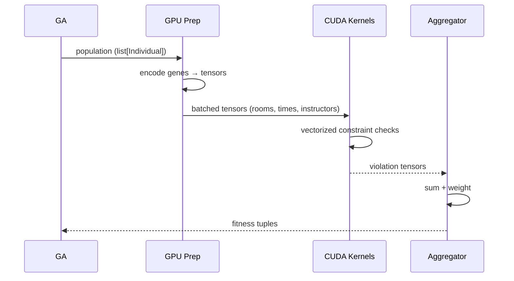

# GPU Acceleration Reference

Constraint evaluation dominates runtime, so we use PyTorch CUDA kernels to process individuals in batches.

## Pipeline



## Files & Functions

| File | Function | Purpose |
| --- | --- | --- |
| `src/ga/evaluator/gpu_batch_evaluator.py` | `evaluate_batch(population)` | Entry point |
|  | `_prepare_batch_tensors(population)` | Packs gene attributes into contiguous tensors |
|  | `_evaluate_constraints_gpu(batch)` | Runs kernels per constraint |
|  | `_aggregate_violations()` | Reduces tensors to Python ints |
| `src/ga/evaluator/cuda_ops.py` | Custom kernels (if defined) | Specialized operations (e.g., pairwise overlaps) |

## Requirements

- NVIDIA GPU with CUDA 12.1 (matching PyTorch build).
- Driver ≥ 535.
- PyTorch 2.4.1+cu121 installed via UV (already pinned).

Check readiness:
```powershell
python -c "import torch; print(torch.cuda.is_available(), torch.version.cuda, torch.cuda.get_device_name(0))"
```

## Configuration

```yaml
evaluator:
  gpu:
    enabled: true
    batch_size: 128
    min_population: 48  # CPU for small cases
    precision: float32
    autocast: true
```

- **`batch_size`** – tune based on VRAM; 128 fits comfortably on 8GB card.
- **`min_population`** – avoid kernel launch overhead for tiny populations.
- **`autocast`** – uses mixed precision; disable if numerical instability occurs.

## Error Handling

- All CUDA calls wrapped in try/except; on failure, warn once and revert to CPU evaluator.
- Set `CUDA_LAUNCH_BLOCKING=1` when debugging race conditions.
- Logs emitted via `logger.warning("GPU evaluator fallback: %s", exc)`.

## Performance Tips

| Tip | Impact |
| --- | --- |
| Pre-allocate tensors | Avoid frequent CUDA malloc/free |
| Keep individuals contiguous | Minimizes tensor reshapes |
| Use `torch.int16` for IDs when possible | Cuts memory footprint in half |
| Monitor with Nsight Systems | Reveal kernel bottlenecks |

## Profiling Commands

```powershell
# PyTorch profiler
python scripts/diagnostics/profile_gpu_evaluator.py --generations 10

# Nsight (if installed)
nsys profile -o gpu_eval python main.py --env test --mode full --generations 50
```

## Testing & CI

- `pytest test/unit/test_gpu_evaluator.py --maxfail=1` (skips automatically if CUDA missing).
- CPU and GPU evaluators share golden outputs; tests compare results to ensure parity within tolerance (1e-6).

## When to Disable GPU

- Running on CI without CUDA (set `evaluator.gpu.enabled = false`).
- Memory-constrained laptops (<4GB VRAM) where CPU might be more predictable.

For deeper architectural background, see `docs/architecture/04-data-flow.md` (fitness evaluation sequence) and `docs/research-papers/00-paper-index.md` (GPU GA references).
